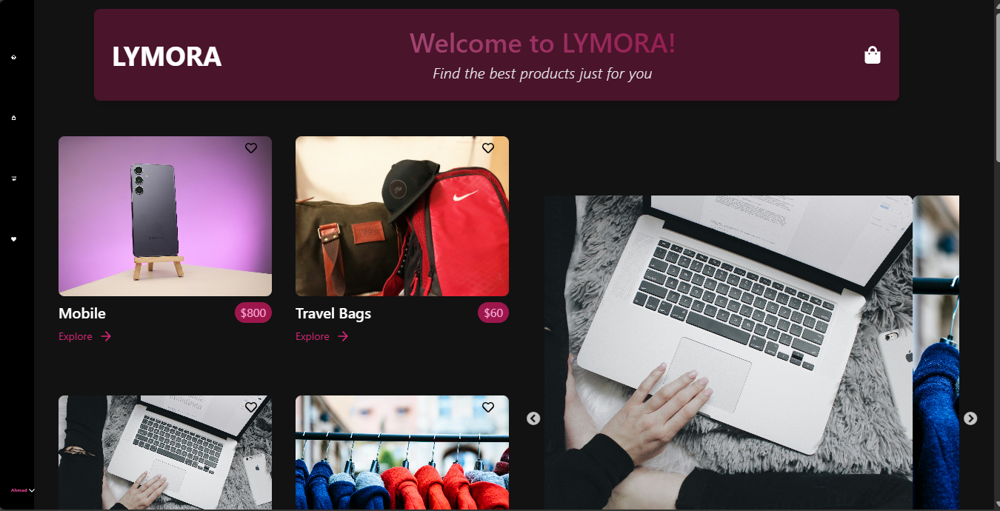

# 🌟 Lymora Ecommerce Website

**Lymora** is a cutting-edge ecommerce platform designed to provide a seamless and user-friendly shopping experience for customers while offering powerful tools for administrators to manage products, orders, and users efficiently. With modern technologies powering its frontend and backend, Lymora ensures performance, security, and scalability.

  

---

## 🖼️ About the Project

Lymora aims to simplify online shopping for customers and empower store owners with easy-to-use admin tools. Whether you’re browsing a variety of products, saving your favorites, or securely placing an order, Lymora ensures a delightful user experience at every step.  

Built with a **React.js** frontend and a **Node.js/Express** backend, Lymora also incorporates powerful features such as **PayPal integration**, real-time order tracking, and a dynamic admin dashboard.  

---

## 🚀 Key Features

### 🛒 Customer-Centric Features
- **Homepage**: View featured products and discover new arrivals.  
- **Product Search & Filters**: Easily find products by category, price, or rating.  
- **Product Details**: Get comprehensive information, high-quality images, and reviews.  
- **Favorites**: Save items you love for future reference.  
- **Shopping Cart**: Add, remove, or adjust product quantities with a live total.  
- **Order Placement**: Smooth checkout process with PayPal payment integration.  
- **Order Tracking**: View order history and monitor the delivery status.

### 🔒 Features for Registered Users
- **User Profile**: Update your profile and manage account details.  
- **Shipping Information**: Add, edit, or manage your shipping addresses.  
- **Order History**: Keep track of all your orders and their statuses.  

### 🛠️ Admin Features
- **User Management**: View, edit, and delete user accounts.  
- **Category Management**: Create and manage product categories.  
- **Product Management**: Add, update, or delete products with detailed descriptions.  
- **Order Management**: Track, process, and fulfill customer orders efficiently.  
- **Admin Dashboard**: Gain insights with analytics and track store performance.

---

## 🛠️ Technologies Used

### **Frontend**
- **React.js**: Modular and reusable UI components.  
- **Redux**: Efficient state management for seamless data handling.  
- **React Router**: Declarative navigation and routing.  
- **Vite**: Fast development environment and optimized production builds.  
- **PayPal Integration**: Secure payment processing.

### **Backend**
- **Node.js**: Scalable server-side runtime.  
- **Express.js**: Lightweight and efficient API development.  
- **MongoDB**: NoSQL database for reliable data storage.  
- **JWT Authentication**: Ensures secure login and session handling.

---

## 📂 Application Routes

### Public Routes
- `/`: Homepage  
- `/login`: Login page  
- `/register`: Registration page  
- `/favorites`: Favorites list  
- `/cart`: Shopping cart  
- `/product/:id`: Product details  
- `/shop`: Browse all products  
- `/order/:id`: View order details  

### Private (User) Routes
- `/profile`: Manage your profile  
- `/shipping`: Add shipping details  
- `/placeorder`: Place an order  
- `/user-orders`: View your orders  

### Admin Routes
- `/admin/userlist`: Manage users  
- `/admin/categorylist`: Manage categories  
- `/admin/product/create`: Add products  
- `/admin/product/update/:id`: Update products  
- `/admin/allproducts`: View all products  
- `/admin/orderlist`: Manage orders  
- `/admin/dashboard`: Admin analytics  

---

## 🖥️ Demo

### Live Deployment
Visit [Lymora eCommerce](https://lymora-ecommerce-store.vercel.app/) to explore the platform live.  

---

